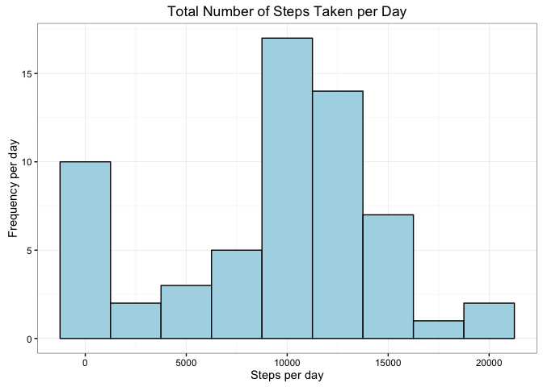
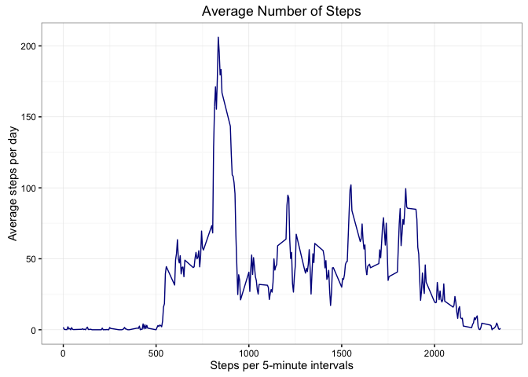
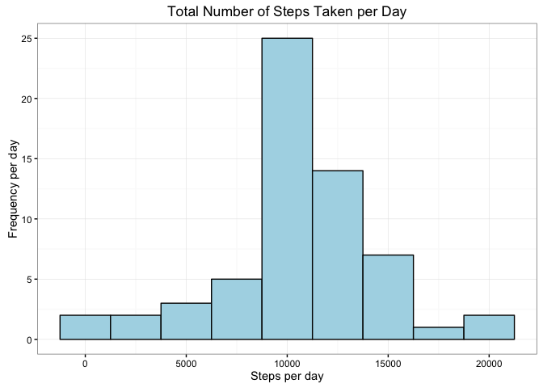
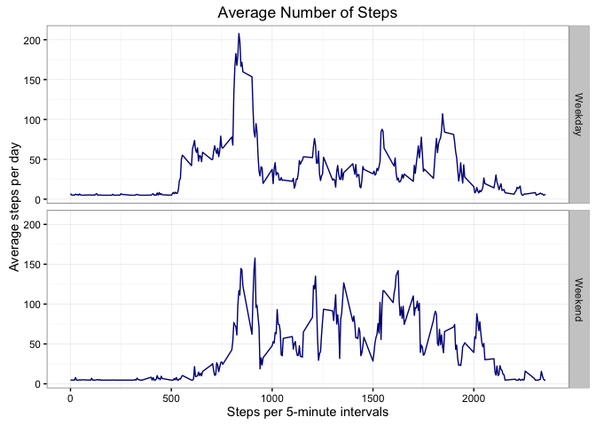

# Reproducible Research: Peer Assessment 1
Selim J Raad  
9/28/2016  


## Loading and processing the data

```r
activity <- read.csv("activity.csv", header = TRUE)
```

Read the structure of the dataset

```r
str(activity)
```

```
## 'data.frame':	17568 obs. of  3 variables:
##  $ steps   : int  NA NA NA NA NA NA NA NA NA NA ...
##  $ date    : Factor w/ 61 levels "2012-10-01","2012-10-02",..: 1 1 1 1 1 1 1 1 1 1 ...
##  $ interval: int  0 5 10 15 20 25 30 35 40 45 ...
```

Process/transform data into a structure suitable for analysis and verify changes by reading the structure

```r
# chnage the date form factor to date and verify the change
activity$date <- as.Date(activity$date)
str(activity)
```

```
## 'data.frame':	17568 obs. of  3 variables:
##  $ steps   : int  NA NA NA NA NA NA NA NA NA NA ...
##  $ date    : Date, format: "2012-10-01" "2012-10-01" ...
##  $ interval: int  0 5 10 15 20 25 30 35 40 45 ...
```

## What is mean total number of steps taken per day?

```r
StepsPerDay <- data.frame(tapply(activity$steps, activity$date, sum, na.rm = TRUE))
colnames(StepsPerDay)[1] <- "TotalSteps"
```

Histogram showing the total number of steps taken each day

```r
library(ggplot2)
p <- ggplot(StepsPerDay, aes(TotalSteps))
p + geom_histogram(binwidth = 2500, fill = I("lightblue"), col = I("black")) +
    labs(x = "Steps per day") +
    labs(y = "Frequency per day") +
    labs(title = "Total Number of Steps Taken per Day") +
    theme_bw(base_family = "Arial", base_size = 11)
```

<!-- -->

The Mean and Median of total steps taken per day

```r
# create a variable for the mean and median
mean <- mean(StepsPerDay$TotalSteps)
median <- median(StepsPerDay$TotalSteps)
# paste together the result and remove the quotes from the sentence
noquote(paste("The Mean is ",format(mean, digits = 2, big.mark = ",", small.mark = ".", nsmall = 2), " and the Median is ",format(median, digits = 2, big.mark = ",", small.mark = ".", nsmall = 2), " steps per day", sep = ""))
```

```
## [1] The Mean is 9,354.23 and the Median is 10,395 steps per day
```

## What is the average daily activity pattern?

```r
# aggregate steps by interval and remove NAs
meanSteps <- aggregate(activity$steps, by = list(activity$interval), mean, na.rm = TRUE)
```

plot a time series of the average numbers by interval

```r
ts <- ggplot(meanSteps, aes(meanSteps[,1], meanSteps[,2]))
ts + geom_line(color = "darkblue") +
     labs(x = "Steps per 5-minute intervals") +
     labs(y = "Average steps per day") +
     labs(title = "Average Number of Steps") +
     theme_bw(base_family = "Arial", base_size = 11)
```

<!-- -->

The maximum number of steps per 5-minute interval

```r
maxSteps <- which.max(meanSteps$x)
maxStepsInterval <- meanSteps[maxSteps, 1]
noquote(paste("The ",format(maxStepsInterval, digits = 2, big.mark = ",", small.mark = ".", nsmall = 2,),"th interval has the maximum of ",format(meanSteps[maxSteps, 2], digits = 2, big.mark = ",", small.mark = ".", nsmall = 0), " steps in a 5-minute interval", sep = ""))
```

```
## [1] The 835th interval has the maximum of 206 steps in a 5-minute interval
```

## Imputing missing values
Calculating the number of NAs

```r
na <- sum(is.na(activity$steps))
noquote(paste("The number of 'NAs' in steps is ",format(na, digits = 2, big.mark = ",", small.mark = ".", nsmall = 2), sep = ""))
```

```
## [1] The number of 'NAs' in steps is 2,304
```

My strategy for filling in all the missing numbers in the dataset is:  
1. Clone the original dataset to fill into values for NAs
2. Calculate the Mean for steps  
3. Select the column to alter and replace NAs with the Mean 

```r
# Create a new dataset to fill into teh NAs
NewActivity <- activity
# Calculate the mean
NewMean <- mean(NewActivity$steps, na.rm = T)
# Select the column to alter, choose rows with NAs and replace with NewMean
NewActivity$steps[which(is.na(NewActivity$steps))] <- round(NewMean, 0)
# verify that all NAs were replaced
which(is.na(NewActivity$steps))
```

```
## integer(0)
```

Calculate the mean and median on the total number of steps per day for the NewActivity datase

```r
NewStepsPerDay <- data.frame(tapply(NewActivity$steps, NewActivity$date, sum, na.rm = TRUE))
colnames(NewStepsPerDay)[1] <- "NewTotalSteps"
```

Histogram showing the total number of steps taken each day for teh NewActivity dataset

```r
library(ggplot2)
p <- ggplot(NewStepsPerDay, aes(NewTotalSteps))
p + geom_histogram(binwidth = 2500, fill = I("lightblue"), col = I("black")) +
    labs(x = "Steps per day") +
    labs(y = "Frequency per day") +
    labs(title = "Total Number of Steps Taken per Day") +
    theme_bw(base_family = "Arial", base_size = 11)
```

<!-- -->

The Mean and Median of total steps taken per day for the NewActivity dataset

```r
# create a variable for the mean and median
NewMean <- mean(NewStepsPerDay$NewTotalSteps)
NewMedian <- median(NewStepsPerDay$NewTotalSteps)
# paste together the result and remove the quotes from the sentence
noquote(paste("The Mean is ",format(NewMean, digits = 2, big.mark = ",", small.mark = ".", nsmall = 2), " and the Median is ",format(NewMedian, digits = 2, big.mark = ",", small.mark = ".", nsmall = 2), " steps per day", sep = ""))
```

```
## [1] The Mean is 10,751.74 and the Median is 10,656.00 steps per day
```

By replacing the "NAs" in the NewActivity dataset with the mean value of the original dataset, we have increased our number of observations as a whole, thus have impacted the Mean, Median, and Standard Deviation of our sample size. As we cansee below, the Mean increased becasue we added 2,304 more observations to the dataset.  Becasue these numbers were all the same, the Median was not greatly affected.  The Standard Deviation however, declined by 6.78% from 112 to 104 indicating less variation from our mean.

```r
library(scales)
noquote(paste("The Mean increased by ",percent(NewMean/mean - 1)," from ",format(mean, digits = 2, big.mark = ",", small.mark = ".", nsmall = 0), " to ",format(NewMedian, digits = 2, big.mark = ",", small.mark = ".", nsmall = 0), " whereas the Median experienced a more modest increase of ",percent(NewMedian/median - 1)," from ",format(mean, digits = 2, big.mark = ",", small.mark = ".", nsmall = 0), " to ",format(NewMedian, digits = 2, big.mark = ",", small.mark = ".", nsmall = 0),sep = ""))
```

```
## [1] The Mean increased by 14.9% from 9,354 to 10,656 whereas the Median experienced a more modest increase of 2.51% from 9,354 to 10,656
```
The above changes are also apparent in our histograms.  
1. The Frequency per day scale (y-axis) increased from a maximum of approximately 17.8 to just above 25.  
2. The bin up to 0 decreased drastically from 10 counts to less than 2.5 counts per day  
3. The bin from 10,000 to 12,500 increase by approximately 47%

## Are there differences in activity patterns between weekdays and weekends?
Creating a new factor variable in the NewActivity dataset with two levels - "weekday" and "weekend"

```r
# create a new column for weekend
NewActivity$date <- strptime(NewActivity$date, "%Y-%m-%d")
NewActivity$day <- as.factor(weekdays(NewActivity$date))
# create a nother column that describes if the day is a weekday or weekend
NewActivity$type <- as.factor(ifelse(NewActivity$day %in% c("Saturday", "Sunday"), "Weekend", "Weekday"))
head(NewActivity)
```

```
##   steps       date interval    day    type
## 1    37 2012-10-01        0 Monday Weekday
## 2    37 2012-10-01        5 Monday Weekday
## 3    37 2012-10-01       10 Monday Weekday
## 4    37 2012-10-01       15 Monday Weekday
## 5    37 2012-10-01       20 Monday Weekday
## 6    37 2012-10-01       25 Monday Weekday
```

Aggregate the data to get the average number of steps taken in each 5-minute interval

```r
NewMeanSteps <- aggregate(NewActivity$steps, by = list(NewActivity$interval, NewActivity$type), mean)
names(NewMeanSteps) <- c("interval", "daytype", "steps")
```

Create a Time Series Plot for Weekdays and Weekend

```r
par(mfrow = c(2, 1))
NewTS <- ggplot(NewMeanSteps, aes(interval, steps))
NewTS + geom_line(color = "darkblue") +
    facet_grid(daytype ~ .) +
    labs(x = "Steps per 5-minute intervals") +
    labs(y = "Average steps per day") +
    labs(title = "Average Number of Steps") +
    theme_bw(base_family = "Arial", base_size = 11)
```

<!-- -->
